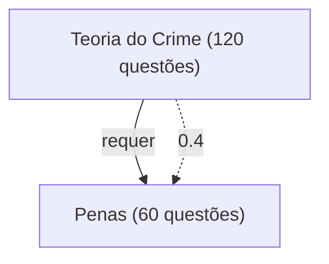

# Dados necessários — o que a skill lê do grafo

Esta skill não impõe formato de arquivo: `scripts/ler_grafo.py` aceita três dialetos. O que ela
exige é **dado**, e cada sinal depende de um campo específico. Sem o campo, o sinal desliga — o
sumário continua saindo, com o buraco declarado em `lacunas.md`.

## Campo → sinal

| sinal do sumário | precisa de | se faltar |
|---|---|---|
| valor base | `peso` (0–100) **ou** `share_pct` **ou** `n_questoes` | todos os itens entram iguais; a ordem vira só topológica (aviso grave) |
| formato cheia/curta/opcional | `n_questoes`, `share_pct`, `edital` | regra de lastro desliga com aviso grave quando a base é uniforme |
| ajuste por edital | `edital` (0–1) | o valor sai só da incidência |
| centralidade "destrava" | arestas `prerequisito` | desliga; β vira 0 e a fila cai para ROI puro |
| ordem de estudo | arestas `prerequisito` | a fila existe, mas não garante pré-requisito antes |
| horas e nº de aulas | `custo_h` | estimado a partir do valor, marcado com `~` |
| coesão da fila | arestas `coocorre` / `correlato` | desempate sem bônus |
| módulos | `pai` (ou aresta `contem`) | um módulo só |
| ressalva de amostra | `confianca` | ninguém é marcado como hipótese |
| rótulo de classe | `classe` (A–D) | a coluna some do sumário |
| cabeçalho honesto | `questoes`, `janela`, `banca_alvo` no front-matter | o sumário não consegue dizer o tamanho da amostra |

Recência e peso de banca **não** são recalculados aqui: chegam embutidos no `peso` do grafo.
Ver `priorizacao.md`.

## Os três dialetos

### 1. Motor (o caminho rico)

Alvo é um diretório com `evidencias.json` — o `grafo.py` de `mapear-conteudo` é importado e o
`calcular()` roda na hora. Traz nós, arestas, parâmetros e as lacunas do próprio grafo em uma
passada. É o que acontece quando você passa `grafos/<slug>`.

### 2. `grafo.md` renderizado

Front-matter + a tabela de `## 3. Nós` + a tabela de `## 4. Arestas`. Quando o escopo é grande e
o motor quebrou as tabelas em `grafo/<disciplina>.md`, o leitor varre esses arquivos também e
avisa se o total de nós não bater com o declarado no front-matter.

Convenções respeitadas, e que valem para qualquer produtor de grafo:

- `prerequisito`: **`de` é o pré-requisito, `para` é o dependente**;
- `contem`: `de` é o pai;
- `coocorre` e `correlato` são não-dirigidas, `forca` em (0, 1];
- `pai` vazio se escreve `—`.

### 3. Genérico (grafo escrito à mão)

Último recurso, para quando alguém entrega um `.md` que não veio do motor:

````markdown

````

ou

```markdown
- Direito Penal
  - [[Teoria do Crime]] (120 questões)
  - [[Penas]] (60 questões)
    - requer: [[Teoria do Crime]]
```

Seta sólida vira `prerequisito`, pontilhada vira `correlato`; rótulo numérico vira `forca`.
Reconhece `(N questões)`, `N min`, `N h` no texto do nó. Um grafo assim não tem edital,
confiança, classe nem banca — metade dos sinais desliga, e o sumário sai dizendo isso.

## Diagnóstico antes de trabalhar

```bash
python3 .claude/skills/montar-sumario/scripts/sumario.py inspecionar <alvo>
```

Imprime a cobertura de cada campo em barra, as raízes, os tipos de aresta e os avisos de leitura.
Se `custo_h` aparecer em 0% ou não houver `prerequisito`, diga ao usuário **antes** de gerar o
sumário — o resultado será mais fraco e ele precisa saber por quê.

## O que pedir a `mapear-conteudo` quando faltar

| falta | o que pedir |
|---|---|
| `prerequisito` | declarar as relações de pré-requisito (passo 6 daquela skill) |
| `custo_h` | estimar custo por nó no `evidencias.json` |
| confiança baixa demais | coletar mais provas da banca-alvo na janela |
| tópico do edital ausente | recolher o edital; a cobertura editalícia é obrigatória lá |

Nada disso se conserta aqui. Editar o grafo à mão quebra a rastreabilidade que justifica o
pipeline inteiro — o `grafo.md` é derivado de `evidencias.json`, e é lá que a correção entra.
